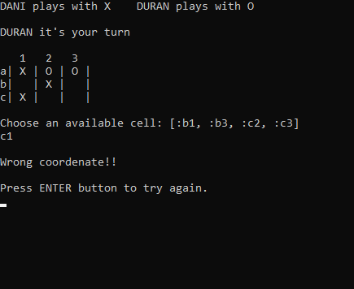

# TicTacToe-Ruby

This is a totally functional Tic Tac Toe game ready to play in your computer terminal. The user interface has been enhaced to achieve the best experience.

## Live version

## Built with

- Ruby

## Features

- **Clean board based on coordenates system.** No more boards full of numbers. Here you will have a clean board where you will see only your marks.
- **Static interface emulation.** No more boards going down in the screen. The display will always show the important information on screen and you will only see one board.

## How to play

- The game is designed to be played by 2 human players.
- Each player has assigned an individual mark, 'X' or 'O'.
- The game consist on a board of 3x3 empty cells which will have to be filled by each player in the correspondent turns.
  - The rows are determined by the letters 'a b c'. The columns are '1 2 3'.
- In each turn both players will have the chance to fill only one cell with their own mark.
  - The game will display the coordenates available. The player just have to insert one of the letters representing the rows and one of the numbers representing the columns.
- The first player to concatenate 3 of his own marks in a row, a column or a diagonal will be the winner and the game will be over.
- If all the cells in the game got filled but none of the players has been able to achive the victory it will be considered a tie.

## Installation

1. Push on the green button that says "Code". You will see it in this repository landing page. It will open a menu with the option "Download ZIP". Click on it and proceed to save the file on your computer.
2. Extract the files in the ZIP file in your desired destination folder.
3. Open the terminal and go to the folder where you have extracted the files.
4. Once in the main folder insert `cd bin`
5. Here you have to insert `./main.rb` to execute the game and follow the instrucions on screen.

## Testing with RSpec

For professional users: RSpec tests have been included to check to correct functioning of the program.
For accessing the RSpec tests follow the previous step 'Installation' must be completed. The you can follow these steps:
1. Go to the main directory `TicTacToe-Ruby`
2. Type `rspec` and press Enter. The tests will be displayed on your screen.
- The tests are stored in the spec folder.

## Author

👤 **Daniel Duran**
- GitHub: [Daniduran-dev](https://github.com/Daniduran-dev)

## 📝License

This project is [MIT](https://opensource.org/licenses/MIT) licensed.
